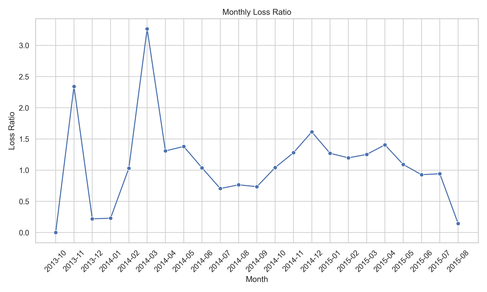
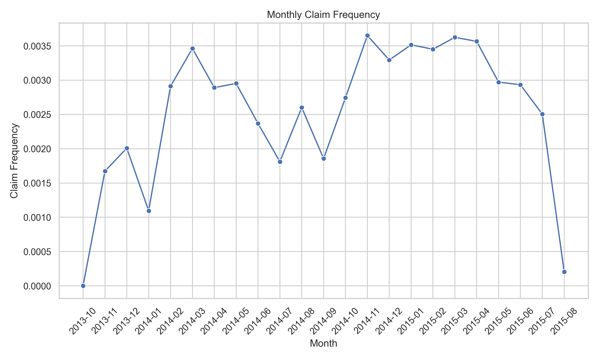

# Insurance Risk Analytics — Week 3

Analyze South African auto insurance data (Feb 2014–Aug 2015) to find low-risk segments, validate risk hypotheses, and build pricing/risk models for AlphaCare Insurance Solutions (ACIS).

## Objectives
- EDA: portfolio loss ratio, geography/vehicle/gender splits, outliers, temporal trends.
- Hypothesis tests (risk & margin): provinces, zip codes, gender.
- Data versioning with DVC for auditability.
- Modeling:
  - Claim severity (TotalClaims | claims > 0).
  - Premium / CalculatedPremiumPerTerm (and optional claim probability).
  - Interpretability with SHAP/LIME.
- Deliverables: interim + final reports with business recommendations.

## Data
Historical policy & claims data (Feb 2014–Aug 2015). Key fields:
- Policy: `UnderwrittenCoverID`, `PolicyID`, `TransactionMonth`
- Client: `IsVATRegistered`, `Citizenship`, `LegalType`, `MaritalStatus`, `Gender`
- Location: `Province`, `PostalCode`, `MainCrestaZone`, `SubCrestaZone`
- Vehicle: `VehicleType`, `Make`, `Model`, `RegistrationYear`, `Kilowatts`, `Bodytype`, etc.
- Plan: `SumInsured`, `CalculatedPremiumPerTerm`, `CoverType`, `CoverGroup`, `Product`
- Payments/Claims: `TotalPremium`, `TotalClaims`

## Project Structure
```
src/
  data/              # loading, cleaning, feature prep
  eda/               # profiling, visuals, outlier checks
  stats/             # hypothesis tests, power checks
  models/            # training, eval, interpretability
  viz/               # plotting utilities
notebooks/           # exploratory + reporting notebooks
scripts/             # CLI entry points (EDA, tests, train, eval)
dvc.yaml             # data & model pipelines (versioned)
```

## Quickstart (Windows PowerShell)
> Use the project virtual env for all commands: `.\.venv\Scripts\Activate.ps1`
```powershell
# create/activate venv
python -m venv .venv
. .\.venv\Scripts\Activate.ps1

# install deps
pip install -r requirements.txt

# optional: install extras for SHAP/LIME/XGBoost
pip install shap lime xgboost

# prepare processed data via DVC pipeline
dvc repro

# run EDA (example)
python .\scripts\run_eda.py --data data/processed/insurance_clean.csv --out outputs/eda

# run hypothesis tests
python .\scripts\run_hypothesis_tests.py --data data/processed/insurance_clean.csv --out outputs/stats

# train models
python .\scripts\train_sentiment_analysis_model.py --data data/processed/insurance_clean.csv --out outputs/models
```

## DVC (reproducible data & models)
Pipeline is defined in `dvc.yaml` with stage `prepare_data`:
```yaml
stages:
  prepare_data:
    cmd: .\.venv\Scripts\python scripts/prepare_insurance_data.py
    deps:
    - data/raw/MachineLearningRating_v3.txt
    - scripts/prepare_insurance_data.py
    outs:
    - data/processed/insurance_clean.csv
```

Workflow (run inside the activated venv):
```powershell
# initialize once (already done in repo)
dvc init
dvc remote add -d localstorage .dvc/storage

# reproduce pipeline
dvc repro

# check status
dvc status

# push tracked data to remote
dvc push
```

Tracked data:
- Raw: `data/raw/MachineLearningRating_v3.txt` (`.dvc` tracked)
- Processed: `data/processed/insurance_clean.csv` (stage output)

Notes:
- `.gitignore` keeps data ignored but allows `.dvc` metadata to be tracked under `data/`.
- Always activate `.venv` before running `dvc repro` to ensure consistent deps.

## Tasks (alignment with brief)
- **Task 1 (EDA & Stats)**: summaries, dtype checks, missingness, univariate/bivariate plots, geography/vehicle/gender splits, outliers, 3+ insight plots.
- **Task 2 (DVC)**: init DVC, set remote, add raw/processed data via pipeline stage, commit `.dvc`/`dvc.lock`, push to remote.
- **Task 3 (Hypothesis Testing)**: tests on provinces, zip codes, margin differences, gender; report p-values and business interpretation.
- **Task 4 (Modeling)**: severity regression, premium prediction (and optional claim probability), compare Linear/RandomForest/XGBoost; report RMSE/R² (regression) and feature importance with SHAP/LIME.

## Outputs
- `outputs/eda/` — profiles & plots.
- `outputs/stats/` — test tables & p-values.
- `outputs/models/` — artifacts, metrics, feature importances.
- `reports/interim.md` — covers Task 1–2.
- `reports/final.md` — Medium-style report: overview, approach, EDA, tests, modeling, recommendations, limitations.

### Key Figures (grid view)
<table>
  <tr>
    <td align="center">
      <br/>
      <sub>Total Premium Distribution</sub>
    </td>
    <td align="center">
      <br/>
      <sub>Total Claims Distribution</sub>
    </td>
    <td align="center">
      <br/>
      <sub>Total Claims Outliers</sub>
    </td>
  </tr>
  <tr>
    <td align="center">
      <br/>
      <sub>Loss Ratio by Province (Top 10)</sub>
    </td>
    <td align="center">
      <br/>
      <sub>Loss Ratio by Vehicle Type (Top 12)</sub>
    </td>
    <td align="center">
      <br/>
      <sub>Monthly Loss Ratio Trend</sub>
    </td>
  </tr>
  <tr>
    <td align="center">
      <br/>
      <sub>Monthly Claim Frequency Trend</sub>
    </td>
    <td></td>
    <td></td>
  </tr>
</table>

## Testing
```powershell
pytest -q
```

## Notes
- Use meaningful branches (`task-1`, `task-2`, …) and PRs to merge to `main`.
- Follow conventional commits, PEP8, and add docstrings/type hints.
- For large categorical cardinality, prefer target/WOE encoding or hashing for tree models; one-hot for low-cardinality fields.